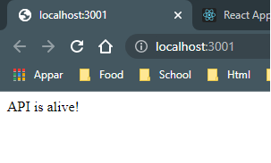

Utfört av: Emilie Öst Utfärdat av: Nordic Retail Group Start: 09:00 - 2022-02-03 Slut: 09:00 - 2022-02-04

# KODTEST

### Ett test för att visa mina kunskaper i JavaScript - Backend Projekt

All info kring hanterandet av Server.js finns i avsnittet om Techlead nedan. Klicka bara på länken så hamnar du där!

1. [Uppgiften](#uppgiften)
2. [GitHub](#github)
3. [NPM](#installera-npm)
4. [Get it Running](#get-it-running)
5. [Entitet](#entitet)
6. [Nodemon](#nodemon)
7. [Insomnia](#insomnia)
8. [Utils](#utils)
9. [MiddleWares](#middlewares)
10. [Configuration](#configuration)
11. [Model](#model)
12. [CRUD](#crud)
13. [Säkerhet](#skerhet)
14. [Kvalitetssäkerhet](#kvalitetsskerhet)
15. [README för techlead](#fr-techlead)

---

## Uppgiften

- Jag ska bygga ett REST API i Express.js
- API ska hantera -
    - Skapa en entitet
    - Uppdatera fält i entiteten
    - Begränsa användaren så att ett fält i entiteten inte går att ändra före ett annat fält är true
- API:et skall vara säkert

---

## GitHub

1. `git init`
2. `git add .`
3. `git commit -m "added project"`
4. `git branch -M main`
5. `git remote add origin git@github.com:areeven/ARBETSPROV_JS.git`
6. `git push -u origin main`

---

## Installera npm

`npm init -y`

npm i -D:

- `express`
- `winston`
- `dotenv`
- `mongoose`
- `morgan`
- `helmet`
- `cors`
- `nodemon`

Testa funktionalitet - npm i:

- `mocha`
- `chai-http`
- `chai`

## Get it running

Jag börjar med en src directory med en Server.js Jag skapar en ExpressApp.js som jag `import Express from 'express'` och
anropar `const ExpressApp = Express()`. Sedan exporterar jag `export default ExpressApp` och på så vis kan jag
återanvända den vid behov utan att anropa Express i varje fil med import och variabel.

Tid som passerat: 1 timme

## Entitet

Planen för denna uppgift är att göra ett API som hanterar Ekologiskt Kaffe Det som ska ingå är:

- Märke
- Smak
- Styrka
- True eller false om det är ekologiskt eller inte

Jag vill testa funktionalitet av min kod och kommer att implementera CRUD för att kunna skapa, läsa av, uppdatera men
också ta bort.

Det kommer vara ett krav att välja om kaffet är ekologiskt annars får man inte uppdatera eller skapa en entitet.

## Nodemon

För att starta upp servern och se så att den fungerar använder jag mig av nodemon:
`npx nodemon Server.js` - när jag står inuti backend-mappen i terminalen.

## Insomnia

Nu när Servern är igång kör jag mitt första test i Insomnia för att se så att det går igenom

Jag testar

- rätt status
- rätt innehåll
- rätt typ

---

- Paus 15 min 10:30-10:45

## Utils

- Logger.js
- ExpressApp.js
- DotEnv.js
    - skapar variabler av alla env-anrop så kan man anropa dessa i varje fil utan att importera dotenv och anropa
      dotenv.config() - dotenv använder jag för en säkrare kod och inte avslöja portar man använder

## Middlewares

Jag skapar en mapp som heter middlewares och i den skapar jag

- Morgan.js
    - I Morgan skapar jag uppbyggnaden utav mina Logger-anrop i terminalen
    - Jag använder Logger för att inte avslöja känslig information i webbläsarens console.

## Configuration

I min configuration directory skapar jag en `ApplyMiddlewares.js`

- Denna kommer att hämta alla middlewares jag vill använda och den importerar jag i min Server.js
    - `ExpressApp.use(helmet())`
    - `ExpressApp.use(Express.urlencoded({extended: false}))`
    - `ExpressApp.use(Express.json())`
    - `ExpressApp.use(Morgan)` - middlewares för att hantera outcome från Logger.

Det kommer också att finnas en fil som heter `CoffeeConfiguration.js` i denna directory lite senare

Tid som passerat: 1 timme Paus 15 min: 11:45-12:00

Skapar `CoffeeConfiguration.js`
Här kommer jag att koppla upp mig mot databasen samt lyssna efter vilken port jag startar servern på. Jag använder
mongoose för att koppla mig mot min mongoDB databas, denna har jag tidigare skapat med:

- `docker run -d -p <port> --name <dbname> mongo:latest`
- I filen hämtar jag min uri som innehåller min mongodb tillsammans med localhost och port.
- `try` för att skapa connection till databasen med mongoose.
- `catch` för att fånga upp error

## Model

Nu skapar jag en model för hur databasens collection kommer se ut, vilka värden som ska finnas med

- Skapar `new mongoose.schema` med typ och om fältet är required.
- Skapar sedan `new mongoose.model` där jag skickar in mitt schema samt vilken collection den tillhör i databasen

Tid som passerat: 1 timme Lunch 1 timme: 13:00 - 14:00

Tid mellan 14:00 - 15:30 har jag gjort följande:

- Suttit med SSL-cert för att skapa ett säkert API. Eftersom att projektet dock är localhost så kommer den inte agera
  korrekt förrän kopplad till dns.

Det tog en stund att få till det, men det funkade till slut. Tid på detta 1,5 timme.

Jag skapade ett selfsigned ssl-certifikat och använde mig av standard x509, tillsammans med openssl och skapade
certificate.crt och privateKey.key. Sedan har jag importerat de i min CoffeeConfiguration.js Det var endel problem i
början med variabler och vart filerna låg. Men till slut fungerar det som det ska! 1,5 timme denna gång. Nästa gång 30
min.

Eftersom att jag dessutom sitter på windows fick jag installera openssl.

## CRUD

Jag har tidigare i projektet skapat en model att använda för min entitet - kaffe. Nu ska jag skapa en controller där jag
kan styra CRUD.

---
Lite färre raster nu, men ju mer jag kommer in i det vill jag fortsätta sitta med det!

---

CoffeeController -\
Nu skapar jag create coffee i min controller, den kommer att slussas vidare till en ny directory som heter routes. Och
där kommer det finns en CoffeeRoutes.js som tar emot createCoffee och där lägger jag till vilken route den ska vara på
samt att den kan kopplas till min Server.js. Huvudpunkten i det hela!

## Säkerhet

För att säkra upp projektet har jag använt mig utav

- Dotenv - säkra känslig information från användare och detta skickas inte upp mot GitHub till exempel
- Logger - för att inte använda console.log och på så vis undvika att känslig information syns i console på webb
- Helmet - skapar ett skal som skyddar kod och känslig information återigen i inspektorn

## Kvalitetssäkerhet

Jag använder

- Insomnia för att testa mina anrop
- Mocha & Chai för att testa min backend i koden

Jag har valt att använda ramverk jag känner mig bekväm i med tanke på tiden som är för projektet. För att verkligen visa
vad jag kan.

## För Techlead

För att komma igång och testa detta projekt behövs följande göras:

1. git clone https://github.com/areeven/ARBETSPROV_JS.git
2. Öppna .env-template och följ stegen i filen
3. `cd backend` i terminalen
4. `npx nodemon Server.js` | `npm nodemon Server.js`
