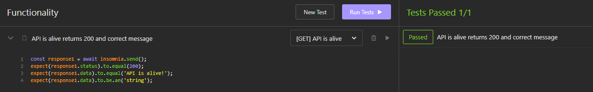

Utfört av: Emilie Öst
Utfärdat av: Nordic Retail Group

1. [Uppgiften](#uppgiften)
2. [GitHub](#github)
3. [NPM](#installera-npm)
4. [Get it Running](#get-it-running)
5. [Entitet](#entitet)
6. [Nodemon](#nodemon)
7. [Insomnia](#insomnia)
8. [Utils](#utils)
8. [MiddleWares](#middlewares)
9. [Configuration](#configuration)

# KODTEST

### Ett test för att visa mina kunskaper i JavaScript - Backend Projekt

---

## Uppgiften
- Jag ska bygga ett REST API i Express.js
- API ska hantera - 
  - Skapa en entitet
  - Uppdatera fält i entiteten
  - Begränsa användaren så att ett fält i entiteten inte går att ändra före ett annat fält är true
- API:et skall vara säkert

---

##Steg ett

###GitHub
1. `git init`
2. `git add .`
3. `git commit -m "added project"`
4. `git branch -M main`
5. `git remote add origin git@github.com:areeven/ARBETSPROV_JS.git`
6. `git push -u origin main`

---

##Steg två

###Installera npm

`npm init -y`

npm i -D:
- `express`
- `winston`
- `dotenv`
- `mongoose`
- `morgan`
- `helmet`
- `cors`
- `nodemon`

Testa funktionalitet - 
npm i: 
- `mocha`
- `chai-http`
- `chai`

### Get it running

Jag börjar med en src directory med en Server.js
Jag skapar en ExpressApp.js som jag `import Express from 'express'` och anropar `const ExpressApp = Express()`.
Sedan exporterar jag `export default ExpressApp` och på så vis kan jag återanvända den vid behov utan att anropa
Express i varje fil med import och variabel.

Tid som passerat: 1 timme

### Entitet

Planen för denna uppgift är att göra ett API som hanterar Ekologiskt Kaffe
Det som ska ingå är:
- Märke
- Smak
- Styrka
- True eller false om det är ekologiskt eller inte

Jag vill testa funktionalitet av min kod och kommer att implementera CRUD
för att kunna skapa, läsa av, uppdatera men också ta bort.

Det kommer vara ett krav att välja om kaffet är ekologiskt annars får man inte uppdatera/skapa
en entitet.

### Nodemon

För att starta upp servern och se så att den fungerar använder jag mig av nodemon:
`npx nodemon Server.js` - när jag står inuti backend-mappen i terminalen.

### Insomnia

Nu när Servern är igång kör jag mitt första test i Insomnia för att se så att det går igenom

Jag testar
- rätt status
- rätt innehåll
- rätt typ
---

- Paus 15 min 10:30-10:45

### Utils

- Logger.js
- ExpressApp.js
- DotEnv.js
  - skapar variabler av alla env-anrop så kan man anropa dessa i varje fil utan att importera 
  dotenv och anropa dotenv.config() - dotenv använder jag för en säkrare kod och inte avslöja portar man använder

### Middlewares

Jag skapar en mapp som heter middlewares och i den skapar jag
- Morgan.js
  - I Morgan skapar jag uppbyggnaden utav mina Logger-anrop i terminalen
  - Jag använder Logger för att inte avslöja känslig information i webbläsarens console.

### Configuration

- I min configuration directory skapar jag e

### Säkerhet

För att säkra upp projektet har jag använt mig utav
- Dotenv - säkra känslig information från användare och detta skickas inte upp mot GitHub till exempel
- Logger - för att inte använda console.log och på så vis undvika att känslig information syns i console på webb
- Helmet - skapar ett skal som skyddar kod och känslig information återigen i inspektorn

### Kvalitetssäkerhet

Jag använder 
- Insomnia för att testa mina anrop 
- Mocha & Chai för att testa min backend i koden